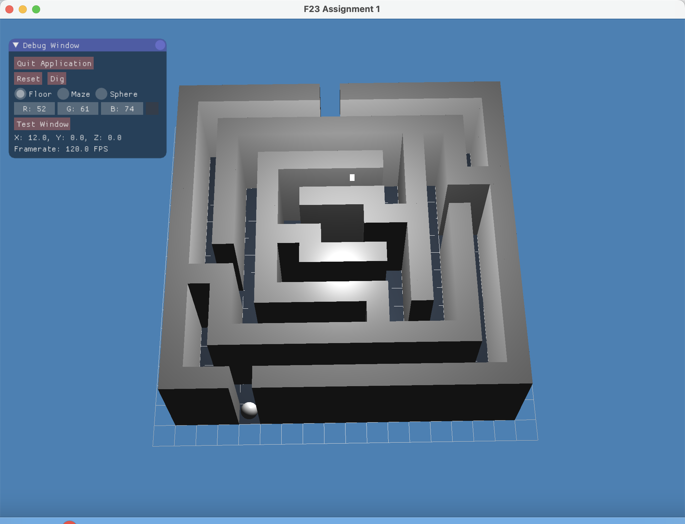

# CS488 Fall 2023 Assignment 1 - README

---

## Introduction

This README provides instructions for compiling and running the CS488/688 assignment 1 and additional information about its features.

---

## Compilation
To compile and run the program, follow these steps:

1. **Unzip the A1.zip File:** 

2. **Execute default premake4/make combination:** 

    ```bash
    $ cd A1
    $ premake4 gmake
    $ make
    $ ./A1
    ```

I've accomplished this assignment on a Mac M1 and verified the code's functionality on the lab machine gl02.

---

# Manual

This manual provides additional details and features beyond the assignment specification.

### Additional Features

1. **Phong lighting model:**
To elevate the visual appeal of our project, I've introduced a simple Phong lighting model. This model comprises three essential components:

    - **Ambient Lighting**: Creates a subtle overall illumination.
    - **Diffuse Lighting**: Simulates the effect of light scattering on surfaces.
    - **Specular Lighting**: Mimics the shiny highlights on objects.

When you run the program, you'll notice a small white cube positioned at (0, 10, 0) – that's our light source, contributing to the dynamic visual experience. You can find all the lighting details in the vertex and fragment shader files.

 
### 2. Smooth Animation

To enhance user immersion, I've incorporated a basic animation logic. Instead of abrupt position changes, the avatar's movement is divided into smaller frames, resulting in a smooth, lifelike animation. For example, when you press the "down" key multiple times, the avatar will gracefully descend to the target position.

Please be aware that the animation speed may differ depending on your operating system. It might appear too slow on some systems or too fast on others. To fine-tune the animation speed to your liking, navigate to line 34 in the `A1.cpp` file. There, you can adjust the `animation_speed` value to achieve a natural movement pace for your specific environment. The default value is optimized for the lab's machine:

```cpp
const float animation_speed = 0.0025f;
