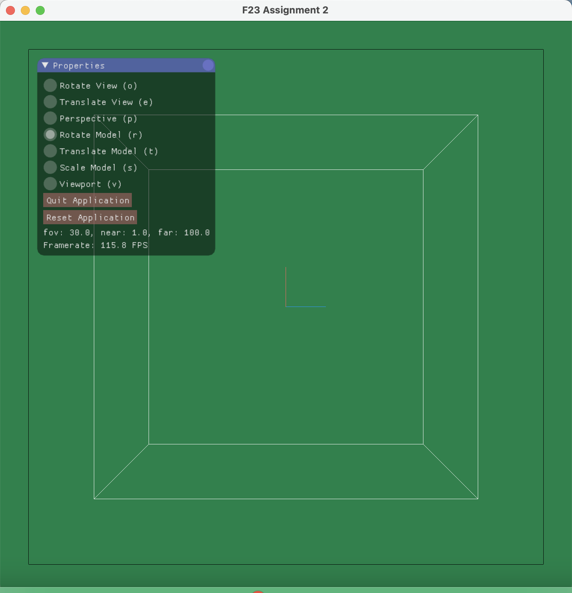

# CS488 Fall 2023 Assignment 2 - README

---

## Introduction

This README provides instructions for compiling and running the CS488/688 assignment 2 and additional information about its features.

---

## Compilation
To compile and run the program, follow these steps:

1. **Unzip the A2.zip File:** 

2. **Execute default premake4/make combination:** 

    ```bash
    $ cd A2
    $ premake4 gmake
    $ make
    $ ./A2
    ```

I've accomplished this assignment on a Mac M1 and verified the code's functionality on the lab machine gl01.

---

# Manual

This manual provides additional details and features beyond the assignment specification.
- In this assignment, the z-axis points towards the screen, the x-axis extends to the right, and the y-axis points upward.
- Create a projection matrix to achieve projection instead of simply dividing by 'z'.
- Implement homogeneous clipping after the projection process.


