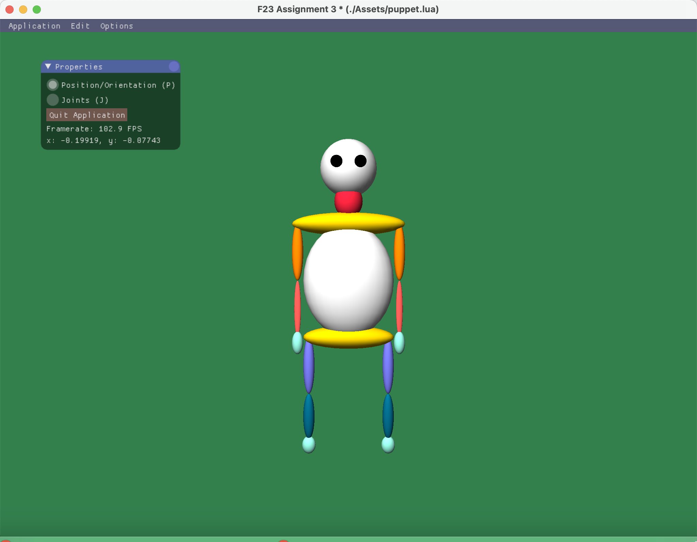

# CS488 Fall 2023 Assignment 3 - README

---

## Introduction

This README provides instructions for compiling and running the CS488/688 assignment 3 and additional information about its features.

---

## Compilation
To compile and run the program, follow these steps:

1. **Unzip the A3.zip File:** 

2. **Execute default premake4/make combination:** 

    ```bash
    $ cd A3
    $ premake4 gmake
    $ make
    $ ./A3 ./Assets/puppet.lua
    ```

I've accomplished this assignment on a Mac M1 and verified the code's functionality on the lab machine gl02.

---

# Manual

This manual provides additional details and features beyond the assignment specification.

## Assumptions

In cases where specific instructions are lacking, I have made the following assumptions:

- **Deselecting Joints on 'Reset All':** When the 'Reset All' function is initiated, all joints are automatically deselected. The interaction mode is also reset to its default position, and Z-buffer, backface culling, and frontface culling settings are reset as well.

- **Undo and Redo Operations:** We assume that undo and redo operations will not alter the selection status of joints. They will retain their selection or deselection based on the user's interactions.

## Changes to Data Structures

I have made the following adjustments to the data structures:

- **JointNode:** A new 'JointId' attribute has been introduced for unique joint identification. Additionally, 'X' and 'Y' angles, as well as the initial transformation, have been included to provide comprehensive support for joint-related operations.

- **SceneNode:** The 'SceneNode' class now features a 'traverse' function, which efficiently traverses the scene graph. This enhancement simplifies processes that involve visiting all nodes within the structure.

- **A3:** I introduces the 'MoveCommand' class, enabling the implementation of undo and redo functions. This addition significantly enhances the application's usability, allowing users to backtrack and make changes as needed.

## hierarchical model

In this picture, all the geometry nodes have green borders, while all the joint nodes have the blue borders.

## screenshot

