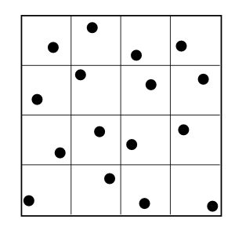
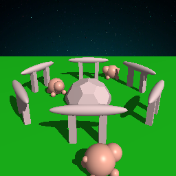
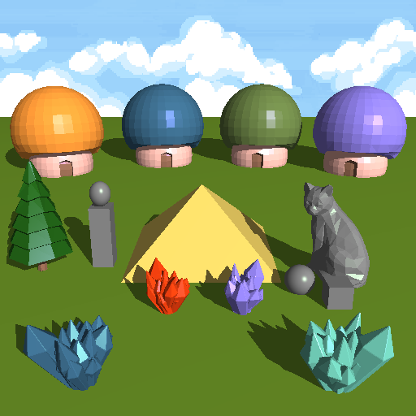

# CS488 Fall 2023 Assignment 4 - README

---

## Introduction

This README provides instructions for compiling and running the CS488/688 assignment 4 and additional information about its features.

---

## Compilation
To compile and run the program, follow these steps:

1. **Unzip the A4.zip File:** 

2. **Execute default premake4/make combination:** 

    ```bash
    $ cd A4
    $ premake4 gmake
    $ make
    $ ./A4 ./Assets/sample.lua
    ```

I've accomplished this assignment on a Mac M1 and verified the code's functionality on the lab machine gl02.

---


# Manual

This manual provides additional details and features beyond the assignment specification.

## Extra Feature - Stratified Sampling


As shown in the above picture, the additional feature implemented is Stratified Sampling. This method combines regular sampling (samples on a 4 × 4 grid for each pixel) and random sampling (adding a uniform random number ξ in the range [0, 1) for each sample). The code implementation is as follows:

```python
for each pixel (i, j) do 
    c=0
    for p = 0 to n − 1 do
        for q = 0 to n − 1 do
            c = c + ray-color(i + (p + ξ)/n, j + (q + ξ)/n)
    c_{ij} = c/(n^2)
```

#### Examples








## Scene Description


In this captivating scene, four Mario houses stand prominently, each adorned with a unique color. At the center of the scene, a gold pyramid commands attention. To its left, a tall tree and an column, crafted from a combination of a sphere and a cube. On the right side of the pyramid, a cat statue presides, accompanied by a ball at its side. The bottom of the scene unveils three distinct crystals, each a visual marvel. The background setting has been transformed into a serene blue sky adorned with gentle white clouds, chosen to complement the scene's aesthetics more fittingly than a starfield picture.

The following image showcases the scene when the bounding box rendering has been turned on.


## Reference

#### Stratified Sampling:

Peter et al. Fundamentals of Computer Graphics, Third Edition, page 311. CRC Press, 2011.

#### Sky Background

https://opengameart.org/content/sky-background

#### Starfield Background

https://500px.com/photo/129251531/nightsky-over-st.-peter-ording-by-redquasar

#### Mario house:

https://www.models-resource.com/custom_edited/mariocustoms/model/53072/

#### Crystal

https://opengameart.org/content/simple-3d-crystals-unwrapped-simple-texture

#### Tree
https://opengameart.org/content/low-polygon-pine-tree
